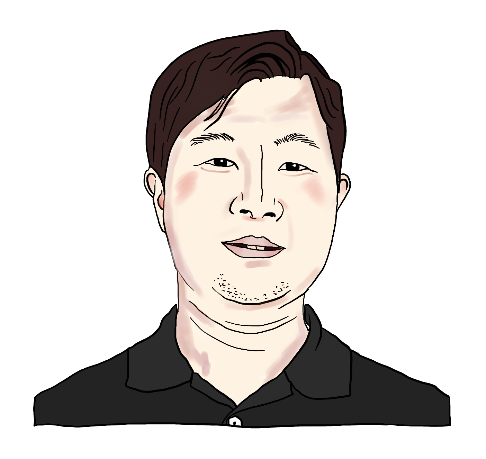

# Saekwang Nam

---
{: .warning }
> I am migrating my old website to this new website. Therefore, this is currently under construction.

---

I am currently a postdoctoral research associate in [Dexterous Robotics Group](https://www.bristolroboticslab.com/dexterous-robotics) of Bristol Robotics Laboratory (University of Bristol), UK. I am working on developing and controlling a **tactile-based robot gripper** for dexterous object manipulation.

<!--  -->

## Short Bio

- **B.E.**, Human & Mechanical Systems Engineering, Kanazawa University  (2007 - 2011)
- **M.S.**, Computer Science, University of California, San Diego (2011 - 2013)
- **Researcher**, Electronics and Telecommunications Research Institute, Daejeon (2013 - 2017)
- **Dr. rer. nat.**, Haptic Intelligence department, Max Planck Institute for Intelligent Systems (2017 - 2022)
    - also affiliated in Computer Science, University of Tuebingen
- **Postdoctoral researcher**, Dexterous Robotics Group, University of Bristol (2022 - present)